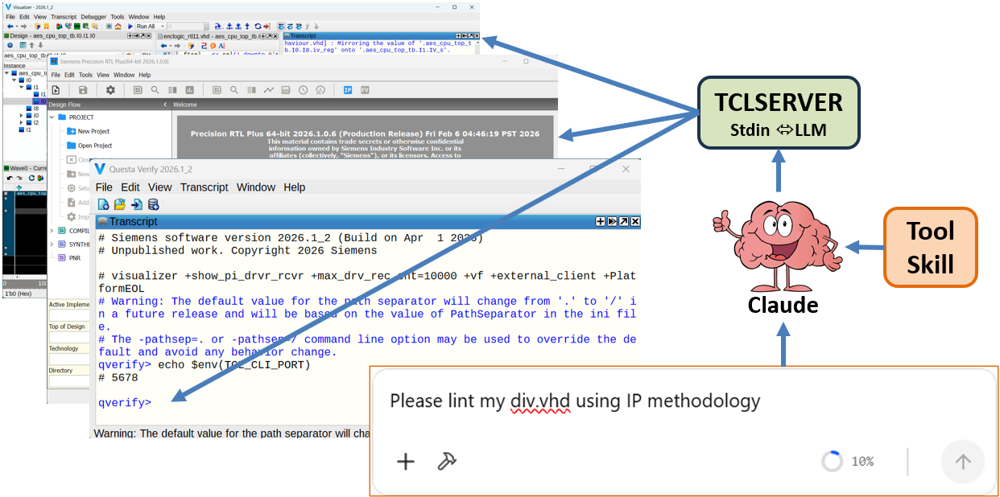
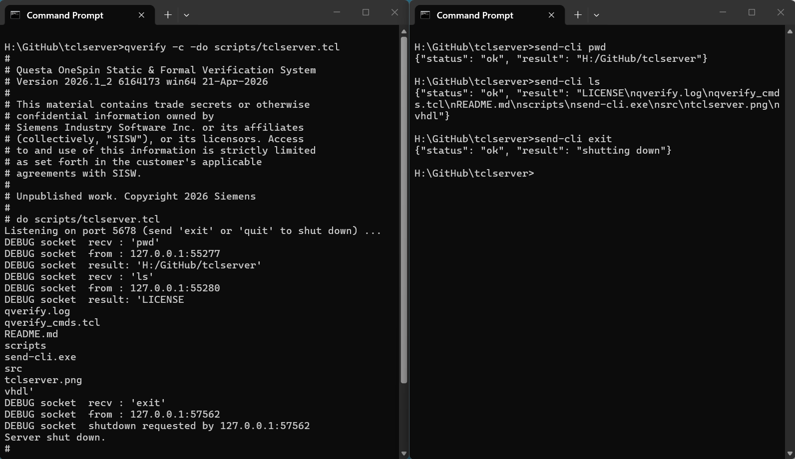
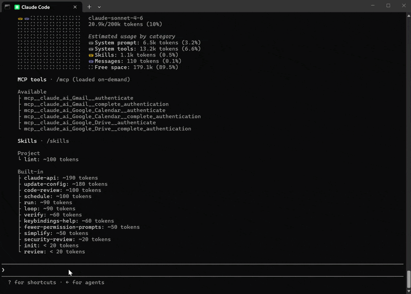

# tclserver - a generic CLI server in Tcl

This repository contains a small Tcl server script that turns any application with an embedded Tcl interpreter into something an LLM can talk to. The LLM (e.g. Claude Code/Codex) sends plain Tcl commands over a socket to the application; the server evaluates them and returns the result via JSON. 

The advantage of this approach is that the `tclserver` is small and lightweight and can run on many applications, the complexities and capabilities are all transferred to an AI's skill domain which the user can easily update and modify.

An example Claude skill is included for **Questa Lint** but as mentioned any application can be targetted provided it has a Tcl interpreter. The skill itself was generated by Claude Sonnet 4.7.


<p align="center">
  
</p>
<p align="center">
Figure: A simple TCL LLM server
</p>


Here is an example of a [Visualizer CLI server](https://github.com/htminuslab/visualizer-cli) and a [Visualizer MCP server](https://github.com/htminuslab/visualizer-mcp).

## How does it work

The `tclserver` is source inside the application (Visualizer, Questa Formal, Precision etc) and opens a listening socket. Anything received on the socket is *eval'd* in the host's Tcl interpreter, so commands like vcom, lint run, add wave, run 10us etc are all effectively executed as if the user typed them in. The result (or error) is returned as a one-line JSON object so an LLM can parse it reliably.

Before running the application you need to set an environmental variable called **TCL_CLI_PORT** which holds the TCP port number. 

You also need something for the LLM to send the commands and returns the info to, for this I have added a small C program called **src/send-cli.c**. This program can be compile on Windows/Linux to simple send any command line options to the TCP port. Like the `tclserver` it also acquires the TCP port number from the **TCL_CLI_PORT** environmental variable. 


## A quick test on Windows

To see if the setup is working you can do a quick test:

1 Open a CMD prompt/Terminal and set TCL_CLI_PORT environmental variable

```
set TCL_CLI_PORT=5678
```

2 Source the tclserver script inside an application, e.g visualizer/qverify/tclsh/etc:

```
qverify -c -do scripts/tclserver.tcl
```

3 Open another CMD prompt/Terminal and set again the same TCL_CLI_PORT variable

```
set TCL_CLI_PORT=5678
```

4 Now try to send a command e.g. *pwd* or *ls* to the application:

```
send-cli pwd
```

You should get back the current working directory the application is running in. You should also see the commands echoed inside the application.

To shut down the `tclserver` close the application or send it a quit or exit command:

```
send-cli exit
```


<p align="center">
  
</p>
<p align="center">
Figure: Quick test
</p>


## The Claude skill - Questa Lint orchestration

The `tclserver` is just a simple script that passes text strings between the application and an LLM. The real power comes from writing an LLM `skill` so that Claude Code/Codex etc knows how to translate a simple command like "simulate my design" to a command sequence for the application.

My recommendation would be to use your LLM to write this skill for you. You need to tell it to use the send-cli program to send commands to the application and to expect results back. Don't use a single prompt, write a detailed `APP_SKILL.md` file describing each step of the process, how to handle an error and what to do with the returned results. This is an iterative process, issue the command, see how the skill interprets it and correct if required.

As an example I have added a Questa Lint skill (generated by Claude sonnet 4.7) that allows me to simple tell Claude to "Lint my code according to the DO-254 standard". Claude will then read the lint skill file and send a bunch of commands to Questa Lint via the send-cli program. The `tclserver` receives those commands and passes them on to Questa Lint. The end results is a lint.rpt file which Claude can use to make any corrections. I also instructed Claude to add a direct command for lint so I can simply issue the '/lint' command.

Example prompts the skill handles:

- `/lint`
- lint my code
- Please lint div.vhd
- Lint my code for Lattice
- run questa lint with methodology ip
- lint goal start, top is cpu_core
- lint and put the report in ./reports, use ISO26262 coding standard
- After a run: correct the source files based on the report

The skill is not perfect and needs further tweaking but it hopefully shows what is possible. 

One of the issues I found is extracting the DUT name from a design. Although Claude could do it occasionally it found the wrong name. For this reason I wrote a *helper function* called `ParseRTL` which not only returns the DUT name it also creates a filelist.txt for compiling the DUT. This list is passed to qrun to compile the design. No compilation order is required if VHDL is used. 

The file ParseRTL.c is located in the src directory and can be compile with:

```
gcc -O2 -Wall -o ParseRTL src/ParseRTL.c
```

The uart directory contains a mixed VHDL Verilog design which I used to test the skill.

Note: if you are running Claude code you can reduce the number of permission interrupts by creating a *settings.local.json* file in the projects .caude directory, example:

```json
{
  "permissions": {
    "allow": [
      "Bash(Get-ChildItem *)",
      "Bash(dir \".\\\\tcl_server\")",
      "PowerShell(send-cli *)",
      "Bash(send-cli *)",
      "PowerShell(New-Item -ItemType Directory -Force *)",
      "Bash(where send-tcl.exe)",
      "Bash(find /c -name 'send-tcl.exe' -type f)",
      "Bash(powershell *)",
      "PowerShell(Get-ChildItem -Path .\\\\tcl_server -Directory -Recurse -ErrorAction SilentlyContinue | Where-Object { $_.Name -eq 'skills' -or $_.Name -eq 'lint' } | Select-Object FullName)"
    ]
  }
}
```

Just ask Claude code to create one for you. You can also issue the `/fewer-permission-prompts` command inside claude code which updates this file for you. If you want to stop all permission prompt then you can use the dangerous option `claude --allow-dangerously-skip-permissions`.


<p align="center">
  
</p>
<p align="center">
Figure: Running Lint on uart example for DO-254
</p>


## Alternative approaches

There are many ways to talk to an application from an LLM. If it has a Tcl interpreter than you can normally source a script from the command line. In this case you can tell your LLM to create/modify an existing script and/or update a filelist followed by executing the application with the script. 

```powershell
qverify -c -do llm_created_run.do
```
Siemens made a very good extension for VScode (Questa Developer), however, I found no way to run a VSCode task from the command line or from an LLM prompt. I am sure this will be added at some point in which case you can also simple ask the LLM to run the "lint task".

Note however that the `tclserver` approach is to enable an *interactive mode* with the LLM, that is when something is not right, or additional operations/instructions are required the LLM can instruct the application to do more rather than modifying the script and re-running the whole application.

As an example, in the mixed language uart design the VHDL source files need to be compiled into a *uart_txt* library, because this is not specified in the qrun command compilation will fail. The skill is instructed to scan the qrun.log file for any errors, in the case of a missing library error it will issues the vmap command to add it. It then compiles the design again this time without any errors and linting continues. 

## Troubleshooting/Issues

- Check that you have set the TCL_CLI_PORT env variable and it is not clashing with any ports already in use. Pick a high number above 1000. 
- Delete all generated files and directories (see clean.bat file), if some file/directory can't be deleted then this indicates some processes might still be running and/or hanging. 
- Check that there is no **vish** or **qverify** process still running.
- Open the .claude/skills/lint/SKILL.md file (use an Markdown Viewer) and issue the commands manually in a PowerShell terminal. Observer any error messages and change the SKILL.md file to fix them. You can view variables with the echo command, example:

```powershell
$du = (.\ParseRTL . -u) | ConvertFrom-Json    # -> {"dut":"div"}
echo $du
```
- The Questa Lint skill was created on Windows and hence will have powershell commands. For Linux ask Claude/Codex to fix the file so that it uses bash instead of powershell. 
- Remove the "-WindowStyle Hidden" style from the powershell command so that the *qverify command line* window is shown

```powershell
Start-Process -FilePath qverify -ArgumentList '-c','-do','scripts/tclserver.tcl'
```
- The skill is instructed to use the qrun commands which simplified the compile sequence, however, the current version is happy to return 0 errors even if one if detected (library not found):

```
# Model Technology ModelSim SE-64 qrun 2026.1_2 Utility 2026.04 Apr  1 2026
# Start time: 10:32:21 on May 30,2026
# qrun -compile -quiet -f fileList.txt -compile
# -- Skipping 'vlog -quiet ./uart/verilog/clock_divider.v -work qrun.out/wo...'
# ** Note: (qrun-20238) VHDL file "./uart/vhdl/uart_top_rtl.vhd" is recompiled because file had error(s) in last compilation run.
# -- Skipping ./uart/vhdl/control_operation_fsm.vhd
# -- Skipping ./uart/vhdl/cpu_interface_rtl.vhd
# -- Skipping ./uart/vhdl/address_decode_rtl.vhd
# -- Skipping ./uart/vhdl/xmit_rcv_control_fsm.vhd
# -- Skipping ./uart/vhdl/status_registers_rtl.vhd
# -- Skipping ./uart/vhdl/serial_interface_rtl.vhd
#
# ** Error: ./uart/vhdl/uart_top_rtl.vhd(34): (vcom-1598) Library "uart_txt" not found.
#
# ** Note: ./uart/vhdl/uart_top_rtl.vhd(36): VHDL Compiler exiting
#
# End time: 10:32:21 on May 30,2026, Elapsed time: 0:00:00
# *** Summary *********************************************
#     qrun: Errors:   0, Warnings:   0
#   Totals: Errors:   0, Warnings:   0
```
Thus the skill needs to check qrun.log and only if no errors are reported continue with the `lint run` command.

- There is no security (like SSL) on the socket which in most cases should not be a problem.


## License

See the LICENSE file for details for this demo. 

 
## Notice
All logos, trademarks and graphics used herein are the property of their respective owners.
